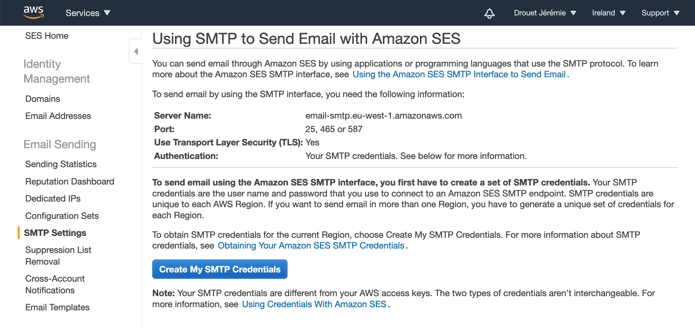

# How to send emails with Mailify and Amazon Simple Email Service

Because you probably don't have an SMTP server available, we'll check how to use the one from Amazon Web Service.

## Preparation

The first thing you have to do is to create an AWS account and access your AWS Console. Once you're there, search in the services "Simple Email Service" (SES)


Once you're on the SES page, you will need to add a new domain to your account (verify it) for SES to check that you're not using someone else's domain name. To do so, go to the `Domains` section and click on `Verify a New Domain`.


When the dialog opens, specify you domain name (like `jolimail.io`), check `Generate DKIM Settings` and click `Verify This Domain`. This will give some values to add in your domain provider's console.

Once you're done with this, it's time to generate your SMTP credentials for Mailify to connect the SMTP server.

For that, go to the `SMTP Settings` section. You'll see the `Server Name` and the `Port` that you'll use afterward to reach the SMTP server. Then, click on the `Create My SMTP Credentials` button and follow the formular to generate the credentials.



Once you've the credentials, download them and keep them secret somewhere, you'll use them later.

## Starting Catapule

To tell mailify how to connect to Amazon Simple Email Service, you need to expose several variables.

```bash
# only if you use the servers from Ireland
export SMTP_HOSTNAME=email-smtp.eu-west-1.amazonaws.com
export SMTP_PORT=465
export SMTP_TLS_ENABLED=true
export SMTP_USERNAME=<YOUR_USERNAME_HERE>
export SMTP_PASSWORD=<YOUR_PASSWORD_HERE>
```

Once you prepared them, just run the following command to start mailify with docker.

```bash
docker run \
  --name mailify \
  -p 3000:3000 \
  -v /where/your/templates/are:/templates:ro \
  -e SMTP_HOSTNAME \
  -e SMTP_PORT \
  -e SMTP_TLS_ENABLED \
  -e SMTP_USERNAME \
  -e SMTP_PASSWORD \
  trinhminhtriet/mailify:latest
```

And that you should be able to send emails with Amazon SES.
